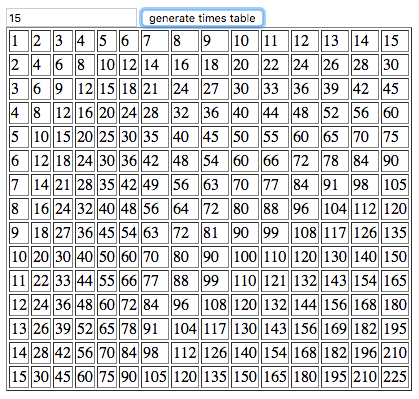
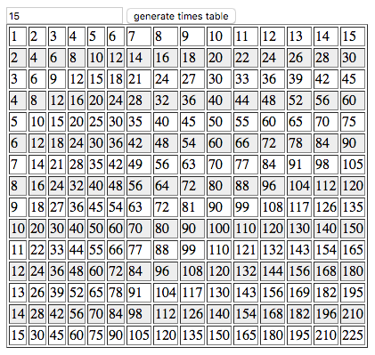
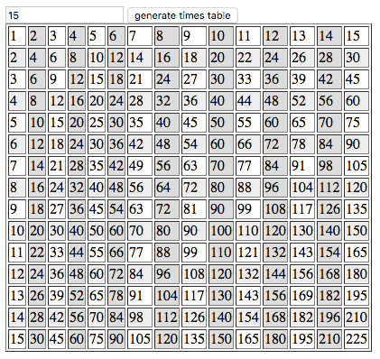

# DOM Times Table
Create a web page that generates a times table.

Your web page should include an input of type `number` and a button. Users
should be able to enter a number they want to see a times table of and press
the button to generate the table.

The top row and left column should be the numbers 0-N where `N` is the number
input by the user. Do not generate a new table for numbers less than one.

- Remove the previous table from the page every time you generate a new one.
- Set the table `border` property to one before it's added to the page so each
  cell is shown correctly.
- Use for loops, functions and parameters to reduce redundant behavior like
  creating rows.

There is no HTML, CSS or JavaScript provided as a starting point for this
project.



## Bonus: Color Cells

Make it easier to look up cells by zebra-striping the table.  Make every other
row gray.


Checker-board the entire table by making every other table division a slightly
different gray color.

Two sample background colors:

```
background-color: #ddd;
background-color: #eee;
```




## Times Tables (Multiplication Tables)
Here's a times table for the number three:

```
1 2 3
2 4 6
3 6 9
```

Here's what that table looks like in HTML.

```
<table>
  <tr>
    <td>1</td>
    <td>2</td>
    <td>3</td>
  </tr>
  <tr>
    <td>2</td>
    <td>4</td>
    <td>6</td>
  </tr>
  <tr>
    <td>3</td>
    <td>6</td>
    <td>9</td>
  </tr>
</table>
```

## Licensing
All content is licensed under a CC­BY­NC­SA 4.0 license.
All software code is licensed under GNU GPLv3. For commercial use or alternative licensing, please contact legal@ga.co.

